# SketchGNN

Streaming Graph Learning for Real-Time Cross-Channel Mule Fraud Detection

A production-grade, real-time fraud detection system that enables millisecond-scale mule detection by compressing dense transaction graphs into constant-size streaming summaries.

## 🚨 Problem Statement

Money mules operate across multiple financial channels to hide laundering behavior.

### A typical pattern:
- Funds are received via Mobile App / UPI
- Money is moved to a linked Wallet
- Cash is withdrawn at an ATM within minutes

Individually, these transactions appear legitimate. Collectively, they form a high-velocity laundering chain.

### Traditional fraud systems fail because:
- Detection rules are siloed by channel
- Graph neighbor expansion causes latency spikes
- High-degree accounts create adjacency explosion
- Real-time SLAs cannot tolerate recursive graph traversal

This creates the **Neighborhood Explosion Problem** in streaming graph ML.

## 💡 Core Idea — SketchGNN

SketchGNN replaces expensive graph traversal with compact, continuously updated behavioral summaries stored per entity.

Instead of expanding neighbors, each account maintains:
- Frequency Sketches (Count-Min Sketch)
- Distinct Counters (HyperLogLog)
- Velocity Metrics (EWMA)
- Channel usage entropy
- Inflow / outflow ratios

These summaries approximate local graph structure and temporal behavior without storing adjacency lists.

### Result:
- O(1) update per transaction
- Constant memory per active node
- Stable millisecond inference at million-scale

## 🏗 System Architecture

```mermaid
flowchart LR
    %% ============== High-Level Real-Time Mule Detection System (Cross-Channel, Graph + GNN) ==============

    %% -------------------- SOURCES --------------------
    subgraph S[Channel Log Sources]
        APP[Mobile App Events]
        WEB[Web Banking Events]
        UPI[UPI / P2P Events]
        ATM[ATM Switch Events]
        WLT[Linked Wallet Events]
        CBS[Core Banking Ledger]
        KYC[KYC / Customer Master]
        DEV[Device / Fingerprint Logs]
        GEO[GeoIP / Location Signals]
    end

    %% -------------------- INGESTION --------------------
    subgraph I[Ingestion & Normalization]
        GW[API Gateway / Log Forwarders]
        KAFKA[(Kafka / Pulsar Topics)]
        SR[Schema Registry]
        DLQ[(Dead Letter Queue)]
        NORM["Normalizer<br/>(map to Unified Event Schema)"]
    end

    %% -------------------- ENRICHMENT & ENTITY RESOLUTION --------------------
    subgraph E[Streaming Enrichment & Entity Resolution]
        FLINK[Flink / Spark Streaming Jobs]
        ENRICH["Enrichment<br/>(device, ip, geo, merchant, atm-id)"]
        ER["Entity Resolution<br/>(probabilistic linking)"]
        PII[PII Vault / Tokenization]
    end

    %% -------------------- GRAPH & STATE --------------------
    subgraph G[Unified Entity Graph + State]
        GSTORE["Graph Store<br/>(online subgraph)"]
        SSTORE["State Store<br/>(RocksDB/Redis)<br/>Sketches + EWMAs"]
        FSTORE["Feature Store<br/>(online)"]
        TTL["Edge TTL / Sliding Window<br/>(24h-72h)"]
    end

    %% -------------------- REAL-TIME SCORING --------------------
    subgraph R["Real-Time Scoring - Two-Speed"]
        GATE["Fast Gate Scorer<br/>(1-5ms)<br/>Rules-lite + Tiny Model"]
        CAND["Candidate Selector<br/>(escalate suspicious slice)"]
        GNN["Micro-batch GNN Inference<br/>(GPU)<br/>20-80ms bounded"]
        DEC["Decision Engine<br/>(allow / step-up / hold / block)"]
    end

    %% -------------------- ACTIONS --------------------
    subgraph A[Actions & Feedback]
        ACT["Action Executor<br/>(block, hold, step-up auth)"]
        CASE[Case Management / Investigator Queue]
        NOTIF["Alerts<br/>(Slack/Email/Pager)"]
        FEED["Feedback Loop<br/>(chargebacks, confirmed fraud)"]
    end

    %% -------------------- OFFLINE / LAKEHOUSE --------------------
    subgraph O[Offline Analytics & Training]
        LAKE[(Data Lake / Warehouse)]
        ETL["Batch ETL + Labeling<br/>(mule chains, rings)"]
        GB["Graph Builder<br/>(training graphs)"]
        TRAIN["GNN Training Pipeline<br/>(TGN/GraphSAGE/etc.)"]
        REG[Model Registry]
        DEPLOY[CI/CD + Canary Deploy]
        DRIFT[Drift + Data Quality Monitoring]
    end

    %% -------------------- OBSERVABILITY --------------------
    subgraph M[Observability]
        MET[(Metrics Store)]
        LOG[(Logs/Traces)]
        DASH["Dashboards<br/>(latency, PR-AUC, FPR)"]
    end

    %% ===== Connections =====
    APP --> GW
    WEB --> GW
    UPI --> GW
    ATM --> GW
    WLT --> GW
    CBS --> GW

    GW --> KAFKA
    KAFKA --> SR
    KAFKA --> NORM
    NORM -->|"bad schema"| DLQ

    NORM --> FLINK
    KYC --> PII
    DEV --> ENRICH
    GEO --> ENRICH
    FLINK --> ENRICH
    ENRICH --> ER
    ER -->|"entity links + weights"| GSTORE
    ER --> SSTORE
    ER --> FSTORE
    TTL --> GSTORE

    %% Real-time scoring path
    FSTORE --> GATE
    SSTORE --> GATE
    GSTORE --> CAND
    GATE --> CAND
    CAND -->|"micro-batch candidates"| GNN
    GNN --> DEC
    GATE --> DEC

    DEC --> ACT
    DEC --> CASE
    DEC --> NOTIF
    ACT --> FEED

    %% Offline path
    NORM --> LAKE
    ENRICH --> LAKE
    FEED --> LAKE
    LAKE --> ETL
    ETL --> GB
    GB --> TRAIN
    TRAIN --> REG
    REG --> DEPLOY
    DEPLOY --> GNN
    DEPLOY --> GATE
    DRIFT --> DASH

    %% Observability
    FLINK --> MET
    GATE --> MET
    GNN --> MET
    DEC --> MET
    ACT --> MET
    FLINK --> LOG
    GATE --> LOG
    GNN --> LOG
    DEC --> LOG
    MET --> DASH
    LOG --> DASH
```

### 1️⃣ Multi-Channel Ingestion

**Sources:**
- Mobile App transactions
- Web banking transactions
- UPI / P2P transfers
- Wallet transactions
- ATM withdrawals
- Core banking events

Events are streamed via Kafka and normalized into a unified schema.

### 2️⃣ Streaming Processing Layer

Apache Flink performs:
- Event enrichment (device, IP, geo, ATM metadata)
- Entity resolution (Account ↔ Wallet ↔ Device ↔ ATM)
- Sketch updates per node
- Feature generation in real-time

State is stored in RocksDB / Redis for low-latency access.

### 3️⃣ Unified Entity Graph (Compressed)

**Nodes:**
- Accounts
- Wallets
- Devices
- IP addresses
- ATMs

**Edges:**
- Transactions
- Device usage
- Wallet linkage

Edges expire via TTL windows to keep the graph bounded. However, inference does not rely on neighbor expansion.

### 4️⃣ Two-Speed Risk Engine

**Layer 1 — Fast Path (1–5 ms)**
- Lightweight sketch features
- Threshold logic or small ML model
- Handles majority of traffic

**Layer 2 — Deep Path (20–80 ms)**
- Triggered only for high-risk entities
- Runs: Compressed graph reasoning, optional GNN model, richer feature extraction
- Human review escalation (if needed)

This layered approach keeps latency predictable under burst traffic.

## Expected Outcomes

- Detect mule accounts in near real-time
- Identify cross-channel laundering sequences
- Block high-velocity ATM cash-outs
- Maintain stable SLAs under traffic spikes
- Avoid graph database bottlenecks

## Conclusion

SketchGNN delivers:

- Big graph intelligence
- Tiny memory footprint
- Stable millisecond detection

It transforms cross-channel mule detection from graph expansion to graph summarization — making real-time fraud prevention feasible at enterprise scale.
